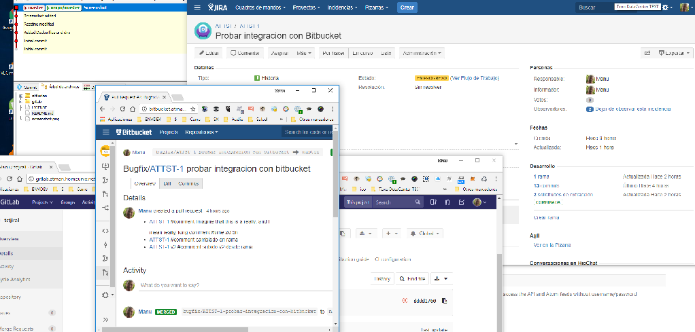

# JIRA Bitbucket and Gitlab on docker containers with local storage

Using docker-compose v3

This docker images provides images for Atlassian JIRA, Bitbucket and Gitlab.
The install is clean, you have to configure db, etc. Just read the docker-compose files ;)
On crash-recovery have a backup of /dockerdata. System will build up from scratch without losing any data.

# Installation

* clone dir
* change docker-compose as you need, but it works out of the box
* Execute docker-compose up on each directory
* open http://localhost:8081 for Gitlab
* open http://localhost:8082 for JIRA
* open http://localhost:8083 for Bitbucket

# Architecture

- JIRA stack runs the server and a separate postgres DB.
- Bitbucket stack runs the server and a separate postgres DB.
- Gitlab stack is the one at https://github.com/sameersbn/docker-gitlab

**NOTE: Data are persisted at /dockerdata on host. Change it to your needs if you want at the docker-compose files**

# Tips and useful scripts

To do things, easier, you can use some aliases instead of docker-compose full syntax commands ;)
Just do dockerup on each dir ;)

* alias dockerup='docker-compose up --build'
* alias dockerdown='docker-compose down --remove-orphans'
* alias dockerrm='docker-compose rm -v'
* alias dockerinit='docker stop $(docker ps -a -q) ;  docker rm $(docker ps -a -q)'

@manufy - Manuel Fernández Yáñez 2017

